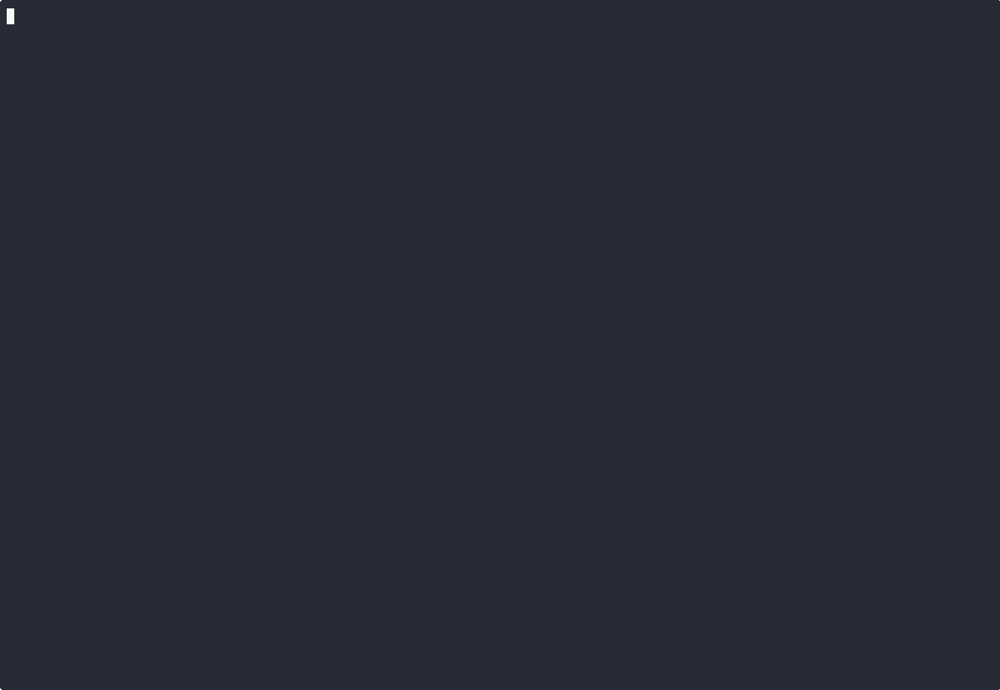

# MCP Chrome Debugger Protocol

MCP server for debugging Node.js applications through Chrome DevTools Protocol (CDP).

Tested with Claude Code CLI.

## Features

* **Debugger Connection**: Connect to Node.js debugger via default port or WebSocket URL
* **Breakpoints & Logpoints Management**: Set, remove, and view breakpoints/logpoints with code context markers
* **Source Maps Support**: Advanced TypeScript/JavaScript mapping with LEAST_UPPER_BOUND bias
* **Conditional Debugging**: Support for conditional breakpoints and logpoints
* **Real-time Monitoring**: View logpoint hits and debugger events

## Demo

### TypeScript with Source Maps Demo



**Available formats:**
- [Animated GIF](demo-ts-mcp-chrome-debugger-protocol.gif)
- [Animated SVG](demo-ts-mcp-chrome-debugger-protocol.svg)  
- [Original asciinema recording](https://asciinema.org/a/CgygsuhpDtOIHV7QPFr6VWU7D)

## Installation

Install using Claude MCP CLI:

```bash
claude mcp add --scope user chrome-debugger-protocol npx @vitalyostanin/mcp-chrome-debugger-protocol
```

**Scope Options:**
- `--scope user`: Install for current user
- `--scope project`: Install for current project only

## Removal

Remove the MCP server:

```bash
claude mcp remove chrome-debugger-protocol --scope user
```

**Scope Options:**
- `--scope user`: Remove from user configuration
- `--scope project`: Remove from project configuration

## Quick Start

1. **Start your Node.js application with debugger:**
   ```bash
   node --inspect your-app.js
   ```

2. **Try this practical example prompt in Claude Code:**

```
* Connect to the already running Node.js debugger
* Set a logpoint INSIDE the function handler for HTTP endpoint test1 to show only requests with query parameter logme=1. Make sure that logpoint is installed on the executable code.
* Immediately show the logpoint with marker
* Execute requests to http://localhost:3000/test1 with this parameter and without it
* Show the triggered log
```

## Available Tools

- **Connection**: `connect_default`, `connect_url`, `enable_debugger_pid`, `disconnect`
- **Breakpoints**: `set_breakpoint`, `set_logpoint`, `remove_breakpoint`, `list_breakpoints`
- **Execution Control**: `resume`, `pause`, `step_over`, `step_into`, `step_out`
- **Inspection**: `evaluate`, `get_call_stack`, `get_scope_variables`
- **Monitoring**: `get_logpoint_hits`, `clear_logpoint_hits`, `get_debugger_events`, `clear_debugger_events`
- **Source Maps**: `resolve_original_position`, `resolve_generated_position`

## Project Creation

This project was designed by my expertise and implemented with AI assistant coding.

## Support

If you find this project useful, consider supporting its development: [Donations](DONATIONS.md)
