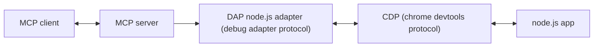
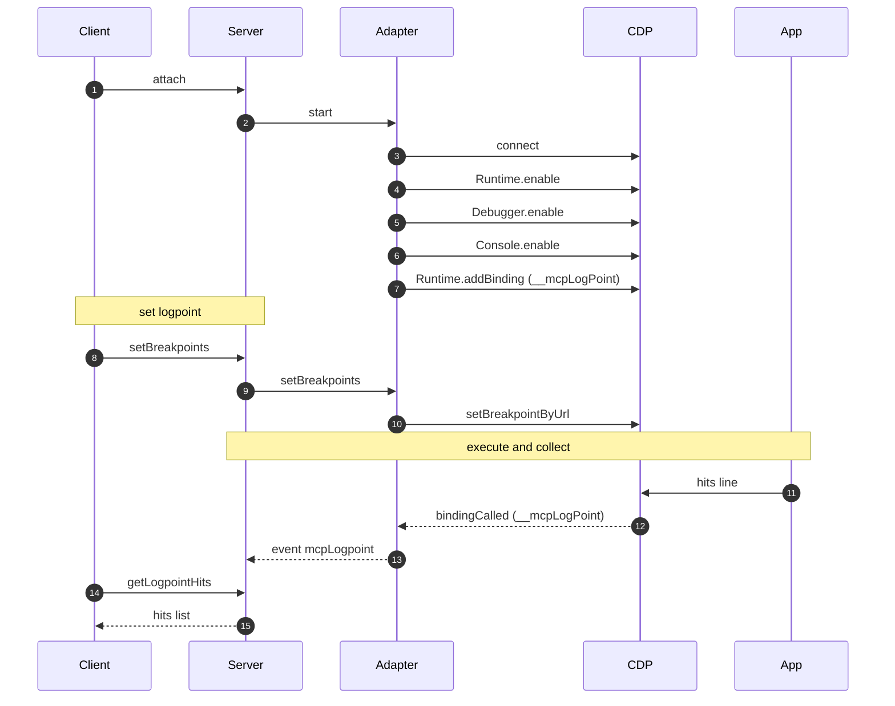

# MCP Chrome Debugger Protocol

MCP server that lets AI coding tools control and observe a running Node.js process through the chrome devtools protocol (CDP), via a lightweight Debug Adapter Protocol (DAP) bridge.

Tested with Claude Code CLI.

## Features

- **Attach/Control**: Attach to a Node.js process by port, WebSocket URL, or PID; pause, continue, and step through code.
- **Breakpoints & Logpoints**: Set/remove classic breakpoints and logpoints (string templates with `{expr}` interpolation) on TS or JS.
- **Source Maps**: Resolve TS↔JS using auto-discovered `*.js.map` with LEAST_UPPER_BOUND bias for reliable placement.
- **State & Events**: Observe pause/resume, custom logpoint hits, and basic thread/stack inspection.
- **Safe Interpolation**: Expressions in `{expr}` are evaluated defensively; errors never break execution (return `undefined`).

## High-Level Diagram



## How It Works (Functional Description)

- **MCP server**: Exposes a set of debugging tools (attach, breakpoints, stepping, inspection) over the Model Context Protocol.
- **DAP bridge**: The server uses an in-process DAP client and a custom Node.js debug adapter that talks directly to CDP.
- **CDP transport**: The adapter enables CDP domains (`Runtime`, `Debugger`, `Console`) and installs a binding named `__mcpLogPoint`.
- **Logpoints**: A logpoint is just a breakpoint whose condition calls `__mcpLogPoint(JSON.stringify(...))` and returns `false` so execution never pauses.
- **Event flow**: The adapter sends a custom DAP event `mcpLogpoint`; the DAP client stores the hit and the MCP server surfaces it via tools and logging.

## Debugger Interaction (Textual Scheme)

1) Attach/initialize
   - MCP client calls `attach`; server creates the adapter and connects to CDP (by URL/port/PID).
   - Adapter: `Runtime.enable`, `Debugger.enable`, `Console.enable`, then `Runtime.addBinding` for `__mcpLogPoint` (and per execution context).

2) Set logpoint / breakpoint
   - MCP client calls `setBreakpoints` against a TS or JS source path and coordinates (1-based line/column).
   - For TS inputs, the server resolves the generated JS location through source maps (or auto-discovers them).
   - Adapter places a CDP breakpoint (`Debugger.setBreakpointByUrl` or by scriptId). For logpoints, the condition evaluates `{expr}` safely and invokes the binding.

3) Execute and collect
   - When code hits the site, CDP fires `Runtime.bindingCalled` with the JSON payload.
   - Adapter emits a DAP custom event `mcpLogpoint` with the raw payload and context id.
   - DAP client parses/stores the hit and emits `logpointHit`; MCP server exposes it via `getLogpointHits` and logging.

## Demo

### TypeScript with Source Maps Demo


**Available formats:**
- [Animated GIF](demo-ts-mcp-chrome-debugger-protocol.gif)
- [Animated SVG](demo-ts-mcp-chrome-debugger-protocol.svg)  
- [Original asciinema recording](https://asciinema.org/a/CgygsuhpDtOIHV7QPFr6VWU7D)

## Installation

Install using Claude MCP CLI:

```bash
claude mcp add --scope user chrome-debugger-protocol npx @vitalyostanin/mcp-chrome-debugger-protocol
```

**Scope Options:**
- `--scope user`: Install for current user
- `--scope project`: Install for current project only

## Removal

Remove the MCP server:

```bash
claude mcp remove chrome-debugger-protocol --scope user
```

**Scope Options:**
- `--scope user`: Remove from user configuration
- `--scope project`: Remove from project configuration

## Quick Start

1. **Start your Node.js application with debugger:**
   ```bash
   node --inspect your-app.js
   ```

2. **Try this practical example prompt in Claude Code:**

```
* Connect to the already running Node.js debugger
* Set a logpoint INSIDE the function handler for HTTP endpoint test1 to show only requests with query parameter logme=1. Make sure that logpoint is installed on the executable code.
* Immediately show the logpoint with marker
* Execute requests to http://localhost:3000/test1 with this parameter and without it
* Show the triggered log
```

Tip: use the `attach` tool to connect; set a logpoint via `setBreakpoints` (pass a breakpoint with `logMessage`), then inspect hits with `getLogpointHits`.

## Available Tools

- Connection: `attach`, `disconnect`, `restart`, `terminate`
- Breakpoints: `setBreakpoints` (supports `logMessage`), `removeBreakpoint`, `getBreakpoints`, `setExceptionBreakpoints`, `breakpointLocations`
- Execution Control: `continue`, `pause`, `next` (step over), `stepIn`, `stepOut`, `goto`, `restartFrame`
- Inspection: `evaluate`, `stackTrace`, `variables`, `scopes`, `setVariable`, `threads`, `loadedSources`, `exceptionInfo`
- Monitoring: `getLogpointHits`, `clearLogpointHits`, `getDebuggerEvents`, `clearDebuggerEvents`, `getDebuggerState`
- Source Maps: `resolveOriginalPosition`, `resolveGeneratedPosition`

## Logpoints

- Placement: logpoints are created via `setBreakpoints` by providing a breakpoint entry with the `logMessage` field.
- Interpolation: use `{expr}` placeholders inside `logMessage`. Expressions are evaluated safely in the target context; errors are swallowed and yield `undefined`.
- Transport: logpoints are implemented through CDP `Runtime.addBinding` and captured via `Runtime.bindingCalled` — no console output prefixing is used.
- Payload: every hit produces a structured payload that is stored and returned by `getLogpointHits`.

Example request to place a logpoint:

```json
{
  "name": "setBreakpoints",
  "arguments": {
    "source": { "path": "/abs/path/to/project/tests/fixtures/test-app/src/index.ts" },
    "breakpoints": [
      { "line": 96, "column": 1, "logMessage": "fib={fibResult} sum={breakpointResult}" }
    ]
  }
}
```

Example of `getLogpointHits` response content (simplified):

```json
{
  "success": true,
  "data": {
    "hits": [
      {
        "timestamp": "2025-08-12T12:34:56.789Z",
        "executionContextId": 1,
        "message": "fib=5 sum=15",
        "payloadRaw": "{\"message\":\"fib=5 sum=15\",\"vars\":{\"fibResult\":5,\"breakpointResult\":15},\"time\":1734000000000}",
        "payload": {
          "message": "fib=5 sum=15",
          "vars": { "fibResult": 5, "breakpointResult": 15 },
          "time": 1734000000000
        },
        "level": "info"
      }
    ],
    "totalCount": 1
  }
}
```

Notes:
- `payload.vars` contains pairs "expression → value" for all `{expr}` in `logMessage`.
- For reliable logpoint placement, use a truly executable line and the correct column (1‑based).

## TypeScript Breakpoints and Source Maps

Two recommended ways to work with TypeScript sources:

1) TS‑first breakpoints and logpoints (recommended)

- Set breakpoints/logpoints directly on the TS file path — the adapter automatically resolves source maps.

```json
{
  "name": "setBreakpoints",
  "arguments": {
    "source": { "path": "/abs/path/to/project/tests/fixtures/test-app/src/index.ts" },
    "breakpoints": [
      { "line": 96, "column": 1, "logMessage": "fib={fibResult} sum={breakpointResult}" }
    ]
  }
}
```

2) Auto‑resolve generated position (fallback)

- If you need an explicit mapping, call `resolveGeneratedPosition` without manually passing map paths by providing `originalSourcePath`. The server auto‑discovers maps under `dist|build|out|lib` relative to the project root and the TS file.

```json
{
  "name": "resolveGeneratedPosition",
  "arguments": {
    "originalSource": "src/index.ts",
    "originalSourcePath": "/abs/path/to/project/tests/fixtures/test-app/src/index.ts",
    "originalLine": 96,
    "originalColumn": 1
  }
}
```

Notes:
- When `originalSourcePath` is provided, the server automatically searches for maps in the project’s build directories and near the TS file location — no `sourceMapPaths` needed.
- The integration script `scripts/mcp-logpoint-check.mjs` follows the TS‑first flow and verifies that logpoint interpolation works on TS lines; it also ensures the Node inspector port `9229` is free after completion.

## Troubleshooting

- Project root detection: for auto source map discovery the server looks for the nearest `package.json` upward from the provided TS path and scans `dist`, `build`, `out`, and `lib`. Ensure your build emits `*.js.map` to one of these folders.
- If maps aren’t found: pass `originalSourcePath` to `resolveGeneratedPosition`, or run the MCP server from the project root so the fallback scan of the current working directory succeeds.
- Coordinates: all MCP/DAP coordinates are 1‑based for both lines and columns. Use `column >= 1` when setting breakpoints/logpoints.
- Logpoint hits: if you see no hits, move the logpoint to an actually executable line (e.g., assignment or expression within the handler), or trigger the endpoint/function that executes that line. In the TS test app, reliable lines include `index.ts:96` (response object) and `index.ts:92` (the `processor.processData()` region).
- WebSocket attach: you can attach via `attach` with `{ "url": "ws://127.0.0.1:<port>/<id>" }`, or enable a running process via `attach` with `{ "processId": <pid> }` (sends `SIGUSR1`).
- PID attach port discovery: when using `attach` with `processId`, the server auto‑discovers the inspector port — the `port` argument is ignored for this path. On Linux, it attempts to detect activation via `strace`; otherwise it polls `http://127.0.0.1:<port>/json/version` across common ports (9229..9250) and falls back to 9229 if nothing is found.

## Architecture

### Detailed Flow



## Project Creation

This project was designed by my expertise and implemented with AI assistant coding.

## Support

If you find this project useful, consider supporting its development: [Donations](DONATIONS.md)
