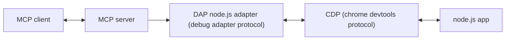
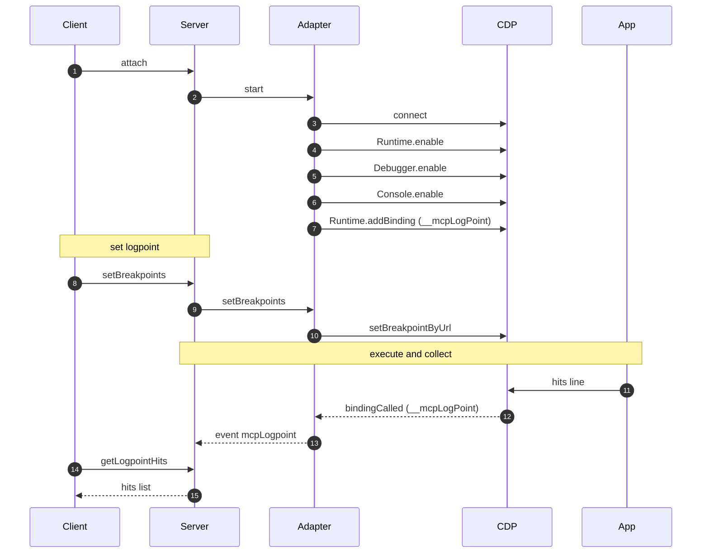

# MCP Chrome Debugger Protocol

[](https://www.npmjs.com/package/@vitalyostanin/mcp-chrome-debugger-protocol)
[](https://github.com/VitalyOstanin/mcp-chrome-debugger-protocol/actions/workflows/node.js.yml)
[](https://codecov.io/gh/VitalyOstanin/mcp-chrome-debugger-protocol)
[](https://nodejs.org)

MCP server that lets AI coding tools control and observe a running Node.js process through the chrome devtools protocol (CDP), via a lightweight Debug Adapter Protocol (DAP) bridge.

Tested with Claude Code CLI.

## Table of Contents

- [Features](#features)
- [High-Level Diagram](#high-level-diagram)
- [How It Works (Functional Description)](#how-it-works-functional-description)
- [Debugger Interaction (Textual Scheme)](#debugger-interaction-textual-scheme)
- [Demo](#demo)
- [Requirements](#requirements)
- [Installation](#installation)
- [Removal](#removal)
- [Security model](#security-model)
- [Quick Start](#quick-start)
- [Development](#development)
- [Verbose diagnostics (DAP_VERBOSE)](#verbose-diagnostics-dap_verbose)
- [Available Tools](#available-tools)
- [Logpoints](#logpoints)
- [TypeScript Breakpoints and Source Maps](#typescript-breakpoints-and-source-maps)
- [Troubleshooting](#troubleshooting)
- [Architecture](#architecture)
- [Project Creation](#project-creation)
- [Support](#support)

## Features

- **Attach/Control**: Attach to a Node.js process by port, WebSocket URL, or PID; pause, continue, and step through code.
- **Breakpoints & Logpoints**: Set/remove classic breakpoints and logpoints (string templates with `{expr}` interpolation) on TS or JS.
- **Source Maps**: Resolve TS↔JS using auto-discovered `*.js.map` with LEAST_UPPER_BOUND bias for reliable placement.
- **State & Events**: Observe pause/resume, custom logpoint hits, and basic thread/stack inspection.
- **Safe Interpolation**: Expressions in `{expr}` are evaluated defensively; errors never break execution (return `undefined`).

## High-Level Diagram


```mermaid
flowchart LR
  C[MCP client] <--> S[MCP server]
  S --> A["DAP node.js adapter (debug adapter protocol)"]
  A <--> I["CDP (chrome devtools protocol)"]
  I <--> N[node.js app]
```

## How It Works (Functional Description)

- **MCP server**: Exposes a set of debugging tools (attach, breakpoints, stepping, inspection) over the Model Context Protocol.
- **DAP bridge**: The server uses an in-process DAP client and a custom Node.js debug adapter that talks directly to CDP.
- **CDP transport**: The adapter enables CDP domains (`Runtime`, `Debugger`, `Console`) and installs a binding named `__mcpLogPoint`.
- **Logpoints**: A logpoint is just a breakpoint whose condition calls `__mcpLogPoint(JSON.stringify(...))` and returns `false` so execution never pauses.
- **Event flow**: The adapter sends a custom DAP event `mcpLogpoint`; the DAP client stores the hit and the MCP server surfaces it via tools and logging.

## Debugger Interaction (Textual Scheme)

1) Attach/initialize
   - MCP client calls `attach`; server creates the adapter and connects to CDP (by URL/port/PID).
   - Adapter: `Runtime.enable`, `Debugger.enable`, `Console.enable`, then `Runtime.addBinding` for `__mcpLogPoint` (and per execution context).

2) Set logpoint / breakpoint
   - MCP client calls `setBreakpoints` against a TS or JS source path and coordinates (1-based line/column).
   - For TS inputs, the server resolves the generated JS location through source maps (or auto-discovers them).
   - Adapter places a CDP breakpoint (`Debugger.setBreakpointByUrl` or by scriptId). For logpoints, the condition evaluates `{expr}` safely and invokes the binding.

3) Execute and collect
   - When code hits the site, CDP fires `Runtime.bindingCalled` with the JSON payload.
   - Adapter emits a DAP custom event `mcpLogpoint` with the raw payload and context id.
   - DAP client parses/stores the hit and emits `logpointHit`; MCP server exposes it via `getLogpointHits` and logging.

## Demo

### TypeScript with Source Maps Demo


**Available formats:**
- [Animated GIF](demo-ts-mcp-chrome-debugger-protocol.gif)
- [Original asciinema recording](https://asciinema.org/a/CgygsuhpDtOIHV7QPFr6VWU7D)

## Requirements

- Node.js >= 22 (set in `engines.node`). Recommended for local development: Node 24 (pinned in `.nvmrc`). CI runs the matrix against Node 22 and 24.
- npm >= 11 (required only for `npm publish`; everyday development works on npm 10+).

## Installation

Install using Claude MCP CLI:

```bash
claude mcp add --scope user chrome-debugger-protocol npx @vitalyostanin/mcp-chrome-debugger-protocol
```

**Scope Options:**
- `--scope user`: Install for current user
- `--scope project`: Install for current project only

## Removal

Remove the MCP server:

```bash
claude mcp remove chrome-debugger-protocol --scope user
```

**Scope Options:**
- `--scope user`: Remove from user configuration
- `--scope project`: Remove from project configuration

## Security model

Run this server only in a trusted local environment (developer workstation, IDE, CI sandbox owned by you). It is **not** designed to sit behind a public proxy or be shared between mutually-distrusting clients.

A connected MCP client is effectively root inside the target Node.js process: `evaluate`, `setBreakpoints` with `condition`, and logpoint `{expr}` placeholders all execute arbitrary JavaScript in the debuggee by design. `attach` refuses non-loopback hosts unless `MCP_CDP_ALLOW_REMOTE=1` is set; when that environment variable is enabled the server prints a stderr warning at startup so a leftover override is hard to miss. Logpoint hits are buffered (FIFO, up to 10 000 entries) and returned on demand — avoid logpoints over secrets/PII.

On Linux, when the server is started as root and `attach` is called with a pid, the target's real uid is read from `/proc/<pid>/status` and the call is refused if the process is owned by another user — kill(pid, 0) succeeds for any pid when uid 0 is the caller, so the explicit uid check is what stops SIGUSR1 from disturbing a foreign user's daemon.

See [docs/SECURITY.md](docs/SECURITY.md) for the full threat model, trust boundaries, mitigations, operational guidance, and the vulnerability reporting process.

## Quick Start

1. **Start your Node.js application with debugger:**
   ```bash
   node --inspect your-app.js
   ```

2. **Try this practical example prompt in Claude Code:**

```
* Connect to the already running Node.js debugger
* Set a logpoint INSIDE the function handler for HTTP endpoint test1 to show only requests with query parameter logme=1. Make sure that logpoint is installed on the executable code.
* Immediately show the logpoint with marker
* Execute requests to http://localhost:3000/test1 with this parameter and without it
* Show the triggered log
```

Tip: use the `attach` tool to connect; set a logpoint via `setBreakpoints` (pass a breakpoint with `logMessage`), then inspect hits with `getLogpointHits`.

Need a target app? The repo ships a tiny Express test app at [`tests/fixtures/test-app`](tests/fixtures/test-app) with a `/test1` endpoint that you can launch under `--inspect` to follow the prompt above end-to-end.

## Development

Local workflow for contributors:

```bash
npm install
npm run build              # tsc -> dist/
npm run typecheck          # tsc -p tsconfig.json (src + tests)
npm run lint               # eslint .
npm run lint:fix           # eslint . --fix
npm test                   # vitest unit tests
npm run test:coverage      # vitest unit tests with coverage report
npm run test:integration   # vitest integration tests (real Node debugger)
npm run test:all           # unit + integration sequentially
npm run dev                # tsc --watch (incremental compile only)
npm run dev:server         # build + run MCP server (stdio)
npm run dev:test           # launch the test-app fixture under --inspect for manual attach
```

End-to-end loop in 30 seconds: run `npm run dev:test` in one terminal (it starts the test-app fixture under `--inspect=9229`), then in another terminal run the MCP server (`npm run dev:server`) and use the `attach` tool from your client.

Formatting: this project relies on ESLint plus `.editorconfig`. There is no separate `prettier` configuration. Run `npm run lint:fix` (or its alias `npm run format`) to apply style fixes. If your editor inserts conflicting formatting, configure it to defer to ESLint.

See [AGENTS.md](AGENTS.md) for detailed contributor rules and project conventions.

## Verbose diagnostics (DAP_VERBOSE)

Set `DAP_VERBOSE=1` (or `DAP_VERBOSE=true`) in the environment to enable verbose adapter diagnostics. When enabled, the server writes additional lines to stderr (and DAP `OutputEvent`s on the wire) for source-map resolution, breakpoint placement, CDP fallbacks, and reconnect attempts.

**Do not enable in production / shared environments.** Verbose output may include:

- Resolved source paths and `*.js.map` filenames from your project.
- User-supplied breakpoint conditions and logpoint `logMessage` templates verbatim. The values interpolated for `{expr}` placeholders are evaluated in the debuggee and therefore not echoed by the adapter, but the template text itself is (e.g. `Logpoint set at /abs/path/src/index.ts:42 - Message: "token={process.env.API_KEY}"`).
- Underlying CDP/DAP error messages, which may quote user input.

Reserve `DAP_VERBOSE=1` for local debugging of the adapter itself. The default (unset) mode emits only fatal errors.

## Available Tools

- Connection: `attach`, `disconnect`, `restart`, `terminate`
- Breakpoints: `setBreakpoints` (supports `logMessage`), `removeBreakpoint`, `getBreakpoints`, `setExceptionBreakpoints`, `breakpointLocations`
- Execution Control: `continue`, `pause`, `next` (step over), `stepIn`, `stepOut`, `restartFrame`
- Inspection: `evaluate`, `stackTrace`, `variables`, `scopes`, `setVariable`, `threads`, `loadedSources`, `exceptionInfo`
- Monitoring: `getLogpointHits`, `clearLogpointHits`, `getDebuggerEvents`, `clearDebuggerEvents`, `getDebuggerState`
- Source Maps: `resolveOriginalPosition`, `resolveGeneratedPosition`

## Logpoints

- Placement: logpoints are created via `setBreakpoints` by providing a breakpoint entry with the `logMessage` field.
- Interpolation: use `{expr}` placeholders inside `logMessage`. Expressions are evaluated safely in the target context; errors are swallowed and yield `undefined`.
- Transport: logpoints are implemented through CDP `Runtime.addBinding` and captured via `Runtime.bindingCalled` — no console output prefixing is used.
- Payload: every hit produces a structured payload that is stored and returned by `getLogpointHits`.

Example request to place a logpoint:

```json
{
  "name": "setBreakpoints",
  "arguments": {
    "source": { "path": "/abs/path/to/project/tests/fixtures/test-app/src/index.ts" },
    "breakpoints": [
      { "line": 96, "column": 1, "logMessage": "fib={fibResult} sum={breakpointResult}" }
    ]
  }
}
```

Example of `getLogpointHits` response content (simplified):

```json
{
  "success": true,
  "data": {
    "hits": [
      {
        "timestamp": "2025-08-12T12:34:56.789Z",
        "executionContextId": 1,
        "message": "fib=5 sum=15",
        "payloadRaw": "{\"message\":\"fib=5 sum=15\",\"vars\":{\"fibResult\":5,\"breakpointResult\":15},\"time\":1734000000000}",
        "payload": {
          "message": "fib=5 sum=15",
          "vars": { "fibResult": 5, "breakpointResult": 15 },
          "time": 1734000000000
        },
        "level": "info"
      }
    ],
    "totalCount": 1
  }
}
```

Notes:
- `payload.vars` contains pairs "expression → value" for all `{expr}` in `logMessage`.
- For reliable logpoint placement, use a truly executable line and the correct column (1‑based).

## TypeScript Breakpoints and Source Maps

Two recommended ways to work with TypeScript sources:

1) TS‑first breakpoints and logpoints (recommended)

- Set breakpoints/logpoints directly on the TS file path — the adapter automatically resolves source maps.

```json
{
  "name": "setBreakpoints",
  "arguments": {
    "source": { "path": "/abs/path/to/project/tests/fixtures/test-app/src/index.ts" },
    "breakpoints": [
      { "line": 96, "column": 1, "logMessage": "fib={fibResult} sum={breakpointResult}" }
    ]
  }
}
```

2) Auto‑resolve generated position (fallback)

- If you need an explicit mapping, call `resolveGeneratedPosition` without manually passing map paths by providing `originalSourcePath`. The server auto‑discovers maps under `dist|build|out|lib` relative to the project root and the TS file.

```json
{
  "name": "resolveGeneratedPosition",
  "arguments": {
    "originalSource": "src/index.ts",
    "originalSourcePath": "/abs/path/to/project/tests/fixtures/test-app/src/index.ts",
    "originalLine": 96,
    "originalColumn": 1
  }
}
```

Notes:
- When `originalSourcePath` is provided, the server automatically searches for maps in the project’s build directories and near the TS file location — no `sourceMapPaths` needed.
- The integration script `scripts/mcp-logpoint-check.mjs` follows the TS‑first flow and verifies that logpoint interpolation works on TS lines; it also ensures the Node inspector port `9229` is free after completion.

## Troubleshooting

- Project root detection: for auto source map discovery the server looks for the nearest `package.json` upward from the provided TS path and scans `dist`, `build`, `out`, and `lib`. Ensure your build emits `*.js.map` to one of these folders.
- If maps aren’t found: pass `originalSourcePath` to `resolveGeneratedPosition`, or run the MCP server from the project root so the fallback scan of the current working directory succeeds.
- Coordinates: all MCP/DAP coordinates are 1‑based for both lines and columns. Use `column >= 1` when setting breakpoints/logpoints.
- Logpoint hits: if you see no hits, move the logpoint to an actually executable line (e.g., assignment or expression within the handler), or trigger the endpoint/function that executes that line. In the TS test app, reliable lines include `index.ts:96` (response object) and `index.ts:92` (the `processor.processData()` region).
- WebSocket attach: you can attach via `attach` with `{ "url": "ws://127.0.0.1:<port>/<id>" }`, or enable a running process via `attach` with `{ "processId": <pid> }` (sends `SIGUSR1`).
- PID attach port discovery: when using `attach` with `processId`, the server auto‑discovers the inspector port — the `port` argument is ignored for this path. On Linux, it attempts to detect activation via `strace`; otherwise it polls `http://127.0.0.1:<port>/json/version` across common ports (9229..9250) and falls back to 9229 if nothing is found.

## Architecture

### Detailed Flow


```mermaid
sequenceDiagram
  autonumber
  participant C as Client
  participant S as Server
  participant A as Adapter
  participant I as CDP
  participant N as App

  C->>S: attach
  S->>A: start
  A->>I: connect
  A->>I: Runtime.enable
  A->>I: Debugger.enable
  A->>I: Console.enable
  A->>I: Runtime.addBinding (__mcpLogPoint)

  Note over C,S: set logpoint
  C->>S: setBreakpoints
  S->>A: setBreakpoints
  A->>I: setBreakpointByUrl

  Note over N,S: execute and collect
  N->>I: hits line
  I-->>A: bindingCalled (__mcpLogPoint)
  A-->>S: event mcpLogpoint
  C->>S: getLogpointHits
  S-->>C: hits list
```

## Project Creation

This project was designed by my expertise and implemented with AI assistant coding.

## Support

If you find this project useful, consider supporting its development: [Donations](DONATIONS.md)
